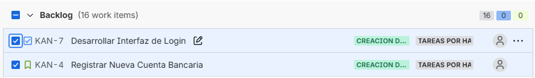
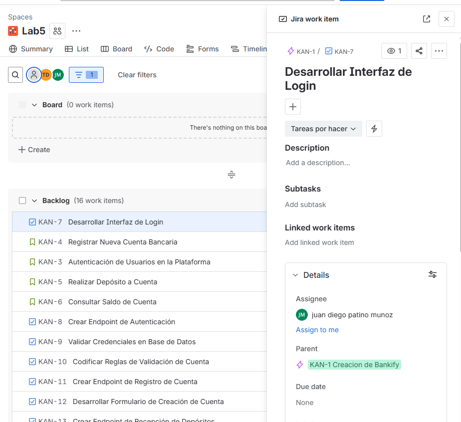
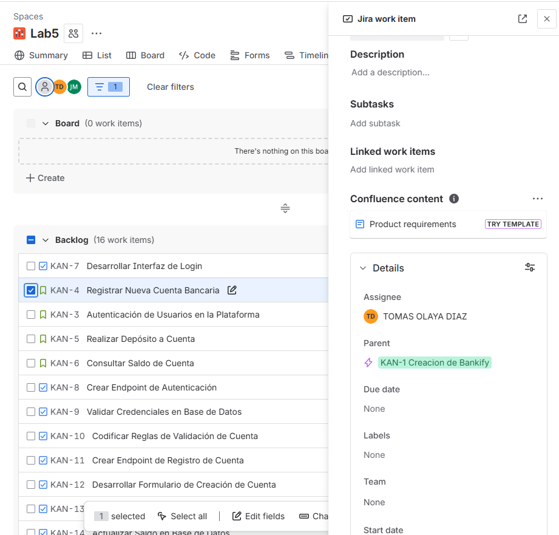
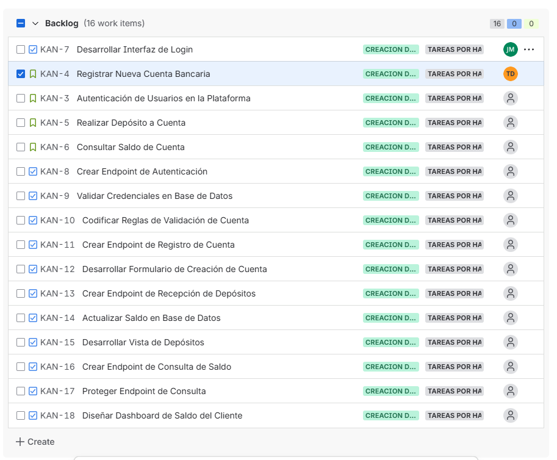

# 📄 Planeación del Sistema en Jira

## Desglose de trabajo: Épicas, Historias de Usuario y Tareas

La implementación de los requerimientos identificados de Bankify se desglosa de la siguiente manera:

### 1. Épica:

### 2. Historias de usuario:

### 3. Tareas:

### 4. Cronograma:

### Historias de usuario

Escogimos estas dos tareas porque son necesarias para el funcionamiento básico de la página, sin esta no tendriamos el "Esqueleto" inicial.
Se agregaron las historias de usuario a los desarrolladores los cuales se decidieron en la reunión, los otros dos, tienen el rol de Scrum Master (Samuel Castelblanco) y Product Owner (Gina Garcia).

### Asignación de tareas

Para Juan Diego Patiño Muñoz -> Desarrollar Interfaz de Login

Para Tomas Olaya Diaz -> Registrar Nueva Cuenta Bacaria

### Backlog

